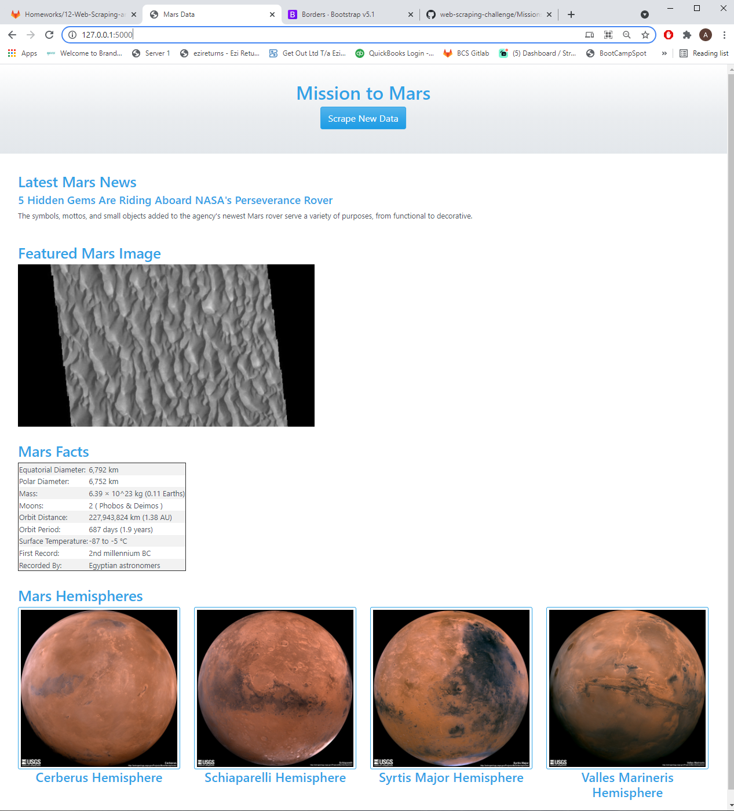
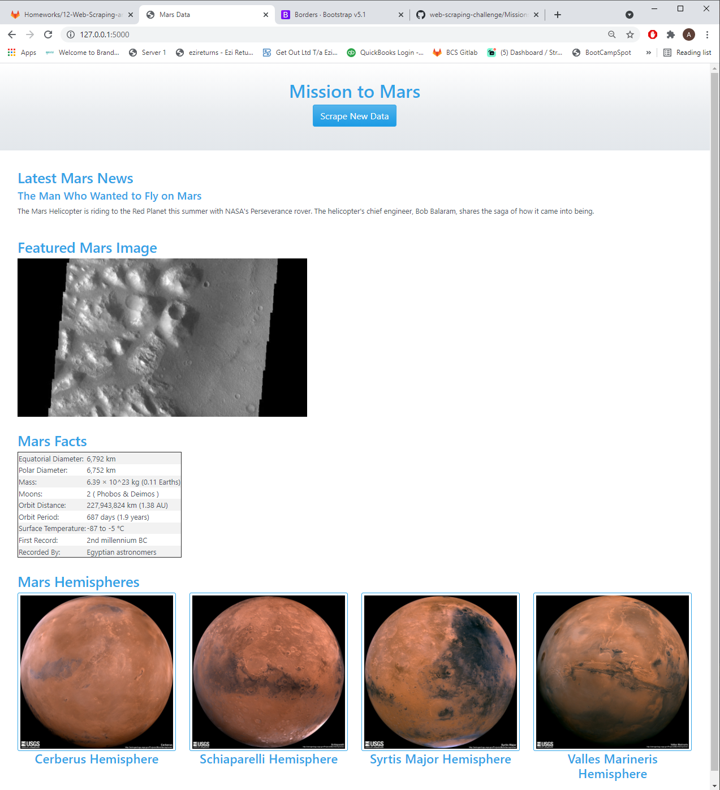

# Web Scraping Challenge

## Outline

In this challenge I combined the use of PyMongo and Beautiful Soup to scrape a website and store the data in a Mongo database.

Then I used Flask and Bootstrap to render a webpage which pulled the stored scraped results from the Mongo Database.

## Issues
The challenge was extremely difficult I was ready to give up when trying to figure out how to loop and scrape and hemisphere images.

## Mars Facts table
The instructions for the assignment specified to scrape the Mars Facts table, however in the example html render image it shows the Mars-Earth Comparison table.

There were 2 tables on the page.

I used the the table with just the Mars Facts.

## Working HTML scrape screenshot
Below is the result of clicking the scrape button. You can see the content successfully changes based on the dynamic content that changed on the original pages that were scraped.
### Scrape 1

### Scrape 2

## Customisation

* bootstrap to make the page suitable for viewing on different devices.
* theme from bootswatch for some customisation.

## Conclusion
This was an extremely difficult assignment. I have a strong feeling of accomplishment having worked my way through and successfully completing all aspects of the assignment.

I would have liked to write a more thorough README, but unfortunately due to the difficulty of the assignment and long time spent on the assignment, I have run out of time. I hope I am not deducted marks for having a short README. Everything on the app works correctly and the webpage displays nicely.