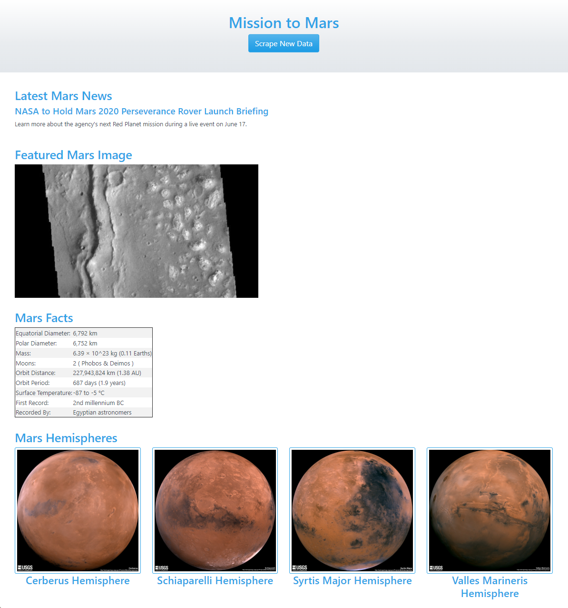
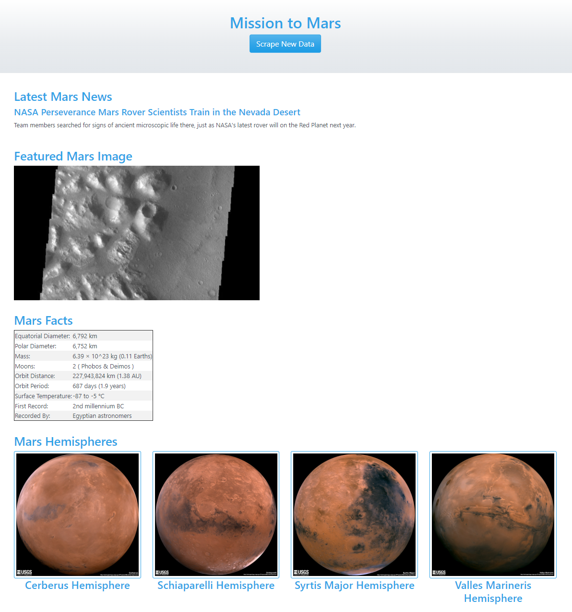

# Web Scraping Challenge

## Working app deployed to Heroku
https://abz-web-scraping-mars.herokuapp.com/

## Summary

Web scraping demonstration using PyMongo and Beautiful Soup to scrape a website and store the data in a Mongo database.

Then I used Flask and Bootstrap to render a webpage which pulled the stored scraped results from the Mongo Database to create a HTML page with the retrieved data.

## Working Scrape Screenshot
Below is the result of clicking the scrape button. You can see the content successfully changes based on the dynamic content that changed on the original pages that were scraped.

### Before Clicking Scrape Button

### After Clicking Scrape Button

## View App
You can view the app by visiting the link below:  
https://abz-web-scraping-mars.herokuapp.com/

 
 

 

### Abz Raja
abzraja@gmail.com